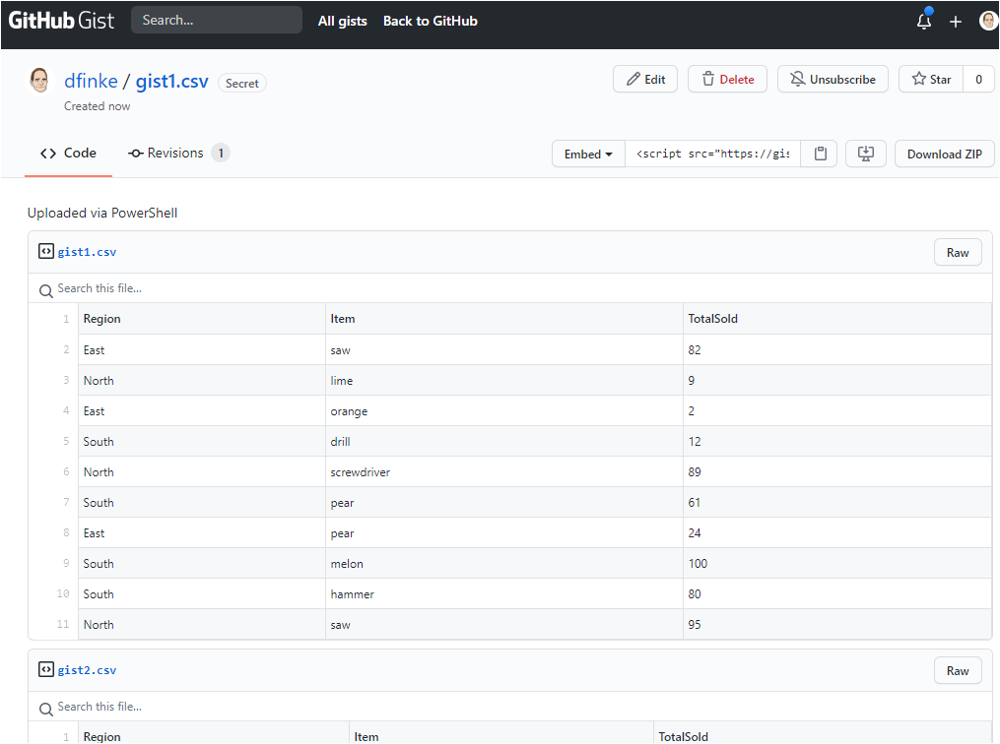

# PSGistIT

## Export-Gist

Create five `csv` files and push them as a single GitHub gist.

```powershell
1..5 | ForEach-Object {
    $(
        "Region,Item,TotalSold"
        1..10 | ForEach-Object {
            $(
                Write-Output North East West South | Get-Random
                Write-Output peach banana apple lemon lime orange pear kiwi avocado melon saw drill hammer nail screwdriver screws | Get-Random
                Get-Random -Minimum 0 -Maximum 101
            ) -join ','
        } 
    ) > "$env:temp\gist$($_).csv"
}

Get-ChildItem $env:temp gist*.csv | Export-Gist
```

## Result

